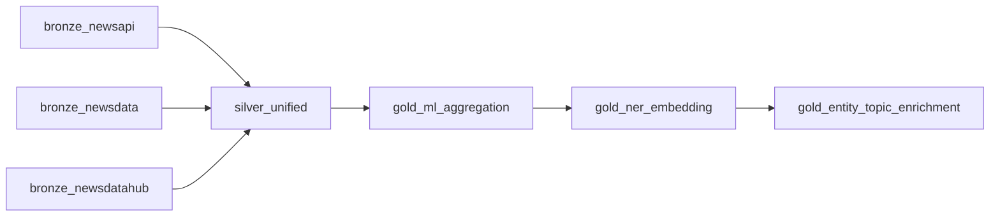
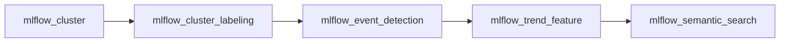
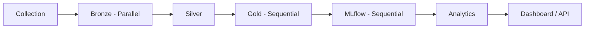

# World in News

### A Global News Intelligence

This system turns raw global news into structured intelligence.

It continuously collects multi-language news from multiple countries, normalizes and enriches it through a production-style medallion pipeline, applies machine learning to detect clusters, events, and trends, and produces analytics-ready outputs that can power dashboards, APIs, monitoring systems, or research platforms.

The result is not just a dataset of articles.

It’s a live signal layer that answers:

* What topics are gaining momentum?
* Which events are forming or spiking?
* What entities are suddenly getting attention?
* Where is media focus shifting?
* What narratives are emerging globally?

You can use it end-to-end — or plug individual layers into your own stack.

This repository is structured to be forked, adapted, and scaled.

---

# System Architecture

Conceptual view of the full pipeline:

```mermaid
flowchart LR

%% ========== INGESTION ==========
subgraph INGESTION["Ingestion Layer"]
    A1[NewsAPI]
    A2[NewsData]
    A3[NewsDataHub]
    C[Collector<br/>Azure Function]
    A1 --> C
    A2 --> C
    A3 --> C
end

%% ========== STORAGE RAW ==========
subgraph RAW["Bronze Layer"]
    B[(Raw Delta Tables)]
end

C -- Parquet Write --> B

%% ========== SILVER ==========
subgraph SILVER["Silver Layer"]
    S[(Unified Corpus<br/>Deduplicated)]
end

B -- Read --> S

%% ========== GOLD ==========
subgraph GOLD["Gold Layer"]
    G1[Language Detection]
    G2[NER Extraction]
    G3[Embeddings]
    G4[(Enriched Delta Tables)]

    S --> G1 --> G2 --> G3 --> G4
end

%% ========== ML ==========
subgraph ML["MLflow Intelligence"]
    M1[Clustering]
    M2[Cluster Labeling]
    M3[Event Detection]
    M4[Trend Modeling]
    M5[Semantic Search]
    MOUT[(ML Artifacts)]

    G4 --> M1 --> M2 --> M3 --> M4 --> M5 --> MOUT
end

%% ========== ANALYTICS ==========
subgraph ANALYTICS["Analytics Layer"]
    AOUT[(Dashboard Tables)]
end

MOUT --> AOUT

%% ========== CONSUMERS ==========
AOUT --> UI[Dashboard / API / App]
```



Each block produces Delta outputs.
Each block can be replaced independently.

---

# Collection Layer

Python-based ingestion engine, designed to run on Azure Functions (24/7) but fully portable.

Sources:

* NewsAPI → [https://newsapi.org/](https://newsapi.org/)
* NewsData → [https://newsdata.io/](https://newsdata.io/)
* NewsDataHub → [https://newsdatahub.com/](https://newsdatahub.com/)

Create your own API keys and configure them in environment variables or function secrets.

Free tier limits are configured by default. Throughput can be increased by upgrading API plans and adjusting `scheduler.py` and CRON settings in `function.json`.

Storage is configurable. Default is Azure Blob, but you can redirect to local storage, S3, or any object store.

Required directory structure:

```
main/
  newsapi/
  newsdata/
  newsdatahub/
staging/
state/
```

Output format: Parquet.

If you only need a multi-source news collector function, you can use this layer alone.

---

# Data Processing Pipeline

Location: `datapipeline/notebooks/`
Engine: Spark + Delta

Execution flow:



Bronze stages are independent and parallelizable. Bronze layer notebooks can be ran togather or in any order.
Silver layer produces the canonical unified corpus for all 3 api data.
Gold layer enriches the data with language detection, entity extraction, and vector embeddings.

Gold output includes:

* Clean normalized text
* Language labels
* Named entities
* Embedding vectors
* Aggregated metadata

This is the ML contract layer.

---

# MLflow Intelligence Layer

Execution order:



Inputs: Gold Delta tables
Outputs: Cluster tables, event tables, trend metrics, vector search indices

This stage enables:

* Topic clustering
* Automatic topic labeling
* Event spike detection (z-score based)
* Momentum and growth indicators
* Semantic similarity search

You can add your own ML stage after Gold or extend this chain without touching upstream layers.

---

# Analytics & Presentation Layer

The analytics stage converts ML outputs into dashboard-ready tables. Heavy aggregations are computed here so that frontend layers remain lightweight.

Final consumers can be:

* Streamlit
* React + API backend
* Power BI
* Internal enterprise dashboards
* Web applications

The intelligence layer is completely decoupled from presentation.

---

# Full Execution Order (For Orchestration)

If deploying on Databricks, Azure Synapse, Airflow, or similar:



From Silver onward, execution is linear.
Bronze can run in parallel.

Each stage writes explicit Delta artifacts, making dependency management clean in any scheduler.

---

# Project Setup

Clone and install:

```bash
git clone https://github.com/kail-vs/sa-news.git
cd sa-news
python -m venv venv
source venv/bin/activate   # Windows: venv\Scripts\activate
pip install -r requirements.txt
```

Set API keys as environment variables:

```bash
export NEWSAPI_KEY=...
export NEWSDATA_KEY=...
export NEWSDATAHUB_KEY=...
```

Configure storage target inside the collection module (local, Azure Blob, S3, etc.).
Collector writes Parquet files.

---

# Execution Order

**Collection**

Create `locat.settings.json'
```json
{
  "IsEncrypted": false,
  "Values": {
    "AzureWebJobsStorage": "UseDevelopmentStorage=true",
    "FUNCTIONS_WORKER_RUNTIME": "python"
  }
}
```

Start the function from `collector` folder:

```bash
func start
```

**Data Pipeline (Spark notebooks)**
Run in order:

```
bronze_*   (parallel)
silver_unified
gold_*
```

**MLflow**

```
mlflow_cluster
mlflow_cluster_labeling
mlflow_event_detection
mlflow_trend_feature
mlflow_semantic_search   (optional)
```

**Semantic Search (Optional)**

`mlflow_semantic_search` requires Docker (Qdrant vector DB):

```bash
docker run -p 6333:6333 qdrant/qdrant
```

If you don’t need semantic search, skip this notebook.
The rest of the pipeline is unaffected.

---